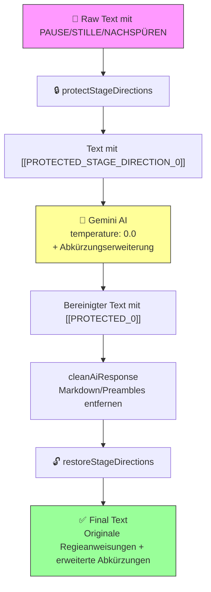
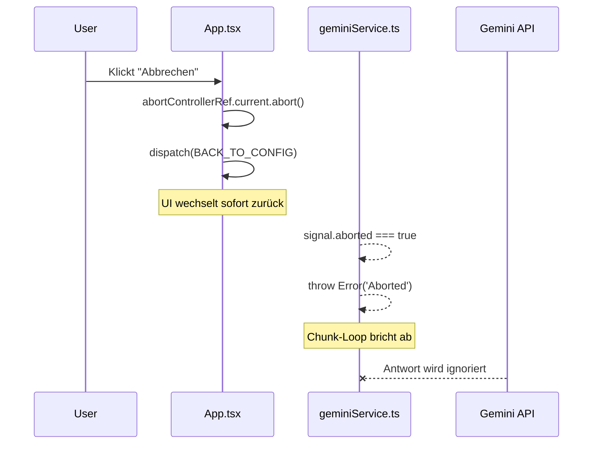

# Developer Guide – EchoForge Bridge

Willkommen zum technischen Entwickler-Leitfaden für die **EchoForge Bridge**, einer React/TypeScript-Webanwendung zur intelligenten Textaufbereitung für Text-to-Speech-Systeme.

---

## 📐 Architektur-Überblick

Die Anwendung folgt einer klaren **Service-Komponenten-Architektur** mit strikter Trennung von Geschäftslogik und Präsentationsschicht.

```
txtZuAudio/
├── src/
│   ├── App.tsx                  # Haupt-Orchestrierung, State Management (useReducer)
│   ├── types.ts                 # TypeScript-Interfaces & Enums
│   ├── constants.ts             # Globale Konfigurationswerte
│   ├── components/              # React UI-Komponenten
│   │   ├── ConfigurationView.tsx   # Bereinigungsregeln-UI
│   │   ├── ResultView.tsx          # Ergebnis-Anzeige & Export
│   │   ├── ProcessingView.tsx      # Fortschrittsanzeige
│   │   ├── PauseControls.tsx       # Pausen-Steuerung (NEU)
│   │   └── ...
│   └── services/                # Stateless Business Logic
│       ├── parserService.ts        # Datei-Parsing (PDF, DOCX, ODT, RTF, TXT)
│       ├── geminiService.ts        # KI-Integration & Offline-Cleaning
│       ├── pauseInjector.ts        # Pausen-Tag-Injection (NEU)
│       └── utils.ts                # Hilfsfunktionen (Sanitization, Chunking)
├── docs/
│   └── DEVELOPER_GUIDE.md       # Diese Datei
└── README.md                    # User-Dokumentation
```

---

## 🧩 Core Services

### 1. **parserService.ts** – Datei-Extraktion

**Zweck:** Extrahiert reinen Text aus verschiedenen Dokumentformaten.

**Unterstützte Formate:**
- **PDF** (`pdf.js`) – Seite-für-Seite-Extraktion mit Memory-Management
- **DOCX** (`mammoth.js`) – 3-Stufen-Fallback (Mammoth → JSZip/XML → Raw Scraper)
- **ODT** (`jszip` + XML-Parsing) – OpenDocument-Support
- **RTF** (`rtf.js`) – Rich Text Format
- **TXT** (Encoding-Erkennung via `jschardet`) – Intelligente Charset-Detection

**Besonderheiten:**
- **Lock-Detection:** Erkennt und retried Dateisystem-Sperren (Virenscanner, laufende Downloads)
- **Robuste Fehlerbehandlung:** Spezifische Fehlermeldungen für Passwort-Schutz, beschädigte Dateien, etc.
- **Progress Callbacks:** Fortschrittsanzeige während Extraktion

**API:**
```typescript
const fileParsers: {
  [extension: string]: (file: File, onProgress?: (percent: number) => void) => Promise<string>
};
```

---

### 2. **geminiService.ts** – Text-Bereinigung (Hybrid)

**Zweck:** Intelligente Textbereinigung via KI (Google Gemini) oder Offline-Regex.

**Modi:**

#### **Online-Modus (KI-gestützt)**
- **Modell:** Google Gemini 2.5 Flash (konfigurierbar)
- **Prompt-Engineering:** Dynamischer System-Prompt basierend auf User-Optionen
- **💎 Zero-Hallucination Policy:** Strikteste Konfiguration für Originaltext-Treue
- **Safety:** Exponential Backoff Retry, 130s Watchdog-Timeout
- **Fallback:** Automatischer Wechsel auf Offline-Modus bei API-Problemen
- **Response Cleaner:** Brute-Force Sicherheitsnetz gegen AI-Artefakte

#### **💎 Zero-Hallucination Policy (Generation Config)**

Im Meditation-Modus wird die KI auf maximale Präzision konfiguriert:

```typescript
config: {
    temperature: 0.0,  // Deterministisch - keine Zufälligkeit
    topP: 0.1,         // Nur die wahrscheinlichsten 10% der Tokens
    // ...
}
```

**Warum diese Werte?**
- `temperature: 0.0` eliminiert jegliche "Kreativität" – die KI wählt immer das wahrscheinlichste Token
- `topP: 0.1` schränkt den Token-Pool zusätzlich ein, um Varianz zu minimieren
- **Ergebnis:** Der Output ist 1:1 reproduzierbar und enthält keine "halluzinierten" Wörter

#### **Offline-Modus (Regelbasiert)**
- **Technologie:** Reguläre Ausdrücke (Regex)
- **Geschwindigkeit:** Nahezu sofortig
- **Datenschutz:** 100% lokal, keine Daten verlassen das Gerät

#### **System-Prompt: "Strict Transcriber" Persona (Meditation Mode)**

Im Meditation-Modus verwendet die KI eine spezielle "Strikter Transkribierer" Persona:

```
═══════════════════════════════════════════════════════════════════
                    ZERO-HALLUCINATION POLICY
═══════════════════════════════════════════════════════════════════

VERBOTEN (ABSOLUT):
• Ändere NIEMALS den Inhalt oder die Formulierung eines Satzes
• Füge KEINE Wörter hinzu - nicht ein einziges
• Entferne KEINE Wörter (außer Seitenzahlen/Metadaten)
• Schreibe KEINE Sätze um - auch nicht zur "Verbesserung"
• KEINE Markdown-Formatierung (keine ```, keine **, keine #)
• KEINE Einleitungen ("Hier ist...", "Gerne...")
• KEINE Erklärungen oder Kommentare

REGIEANWEISUNGEN SIND HEILIG:
• Zeilen mit PAUSE, STILLE, NACHSPÜREN (egal ob groß/klein geschrieben)
• Auch mit Adjektiven: KURZE PAUSE, LANGE STILLE, etc.
• Diese Zeilen werden EXAKT 1:1 übernommen - KEINE Korrektur!
```

**Kernprinzip:** Die KI ist "dumm und präzise" – sie transkribiert nur, sie formuliert nicht um.

#### **Response Cleaner (Brute-Force Safety Net)**

Als letztes Sicherheitsnetz existiert die Funktion `cleanAiResponse()`, die **gnadenlos** alle KI-Artefakte entfernt – selbst wenn die KI ihre Prompt-Instruktionen ignoriert:

```typescript
function cleanAiResponse(response: string): string
```

**Was wird entfernt (verschärft):**

| Artefakt-Typ | Regex/Methode | Beispiel |
|--------------|---------------|----------|
| **Markdown Code-Blöcke** | `/```(?:json\|text\|markdown)?\s*/gi` | ` ```text ... ``` ` (überall im Text) |
| **Umschließende Anführungszeichen** | `/^["']([\s\S]*)["']$/m` | `"gesamter Text"` → `gesamter Text` |
| **AI-Preambles (DE)** | Mehrere Patterns | "Hier ist...", "Gerne!", "Natürlich...", "Ich habe..." |
| **AI-Preambles (EN)** | Mehrere Patterns | "Here is...", "Sure!", "Of course..." |
| **Trailing Kommentare** | `/\n*(?:Hinweis\|Note)...\$/i` | Nachgestellte Erklärungen |
| **Bold-Formatierung** | `/\*\*([^*]+)\*\*/g` | `**fett**` → `fett` |
| **Italic-Formatierung** | `/(?<=\s)\*([^*\n]+)\*(?=\s\|$)/g` | `*kursiv*` → `kursiv` |

**Integration:** Wird in `processChunkWithWatchdog()` nach dem Streaming-Response aufgerufen.

**Philosophie:** Lieber zu viel entfernen als Artefakte im Output zu haben.

---

#### **🛡️ Stage Direction Protection Loop (Meditation Mode)**

Im Meditation-Modus werden Regieanweisungen durch einen technischen Schutzmechanismus vor der KI geschützt:



**Warum dieser Mechanismus?**
- Die KI kann selbst mit `temperature: 0.0` unvorhersehbar auf ungewöhnliche Zeilen (wie "STILLE") reagieren
- Durch Placeholder-Maskierung sieht die KI nur `[[PROTECTED_STAGE_DIRECTION_0]]` – ein neutrales Token
- Nach der KI-Verarbeitung werden die Placeholder durch die Originaltexte ersetzt
- **Ergebnis:** 100% garantierte Erhaltung der Regieanweisungen

**Code-Referenz:**
```typescript
// Protection vor KI-Aufruf
const { protectedText, originalLines } = protectStageDirections(chunk);

// Nach KI-Response
cleanedContent = restoreStageDirections(cleanedContent, protectedLines);
```

---

#### **📚 Abkürzungserweiterung (60+ Abkürzungen)**

Die Anwendung expandiert automatisch 60+ deutsche Abkürzungen für optimalen TTS-Lesefluss.

**Kategorien und Beispiele:**

| Kategorie | Abkürzungen |
|-----------|-------------|
| **Allgemein** | z.B. → zum Beispiel, d.h. → das heißt, ggf. → gegebenenfalls, bzw. → beziehungsweise, etc. → et cetera, usw. → und so weiter, bspw. → beispielsweise |
| **Referenzen** | vgl. → vergleiche, s.o. → siehe oben, s.u. → siehe unten, o.g. → oben genannt, i.d.R. → in der Regel, v.a. → vor allem, z.T. → zum Teil |
| **Umstände** | u.a. → unter anderem, u.U. → unter Umständen, o.Ä. → oder Ähnliches, evtl. → eventuell, ggf. → gegebenenfalls |
| **Titel/Anrede** | Dr. → Doktor, Prof. → Professor, Hr. → Herr, Fr. → Frau |
| **Dokument-Struktur** | Nr. → Nummer, Art. → Artikel, Abs. → Absatz, Kap. → Kapitel, Abb. → Abbildung, ff. → fortfolgende |
| **Zeit/Maße** | Std. → Stunde, min. → Minute, ca. → circa, max. → maximal, tgl. → täglich, mtl. → monatlich |
| **Finanzen/Recht** | zzgl. → zuzüglich, abzgl. → abzüglich, inkl. → inklusive, exkl. → exklusive, gem. → gemäß, lt. → laut |
| **Sonstiges** | Fa. → Firma, Str. → Straße, Tel. → Telefon, Stk. → Stück, sog. → sogenannt, bzgl. → bezüglich |

**Implementierung:** `utils.ts` → `COMMON_ABBREVIATIONS` Array

**Wann werden Abkürzungen expandiert?**
- Im Pre-Pass *vor* dem KI-Aufruf (`expandAbbreviations()`)
- Funktioniert in beiden Modi (Online & Offline)
- Im Meditation-Mode: Abkürzungen werden expandiert, aber geschützte Zeilen bleiben unberührt

---

**Bereinigungslogik (Details):**

| Kategorie | Online (KI) | Offline (Regex) |
|-----------|-------------|-----------------|
| **Seitenzahlen** | Kontextsensitiv | `/^\s*\d+\s*$/gm` |
| **Kapitelmarker** | Intelligent | `/^(Kapitel\|Chapter\|Teil\|Part)...\$/gim` |
| **URLs** | Semantisch | `/((https?:\/\/\|www\.)[^\s]*[^.,?!...])/gi` |
| **E-Mails** | Vollständig | `/[a-zA-Z0-9._%+-]+@[a-zA-Z0-9.-]+\.[a-zA-Z]{2,}/g` |
| **Silbentrennung** | Reparatur | `/([a-zäöüß])-\s*\n\s*([a-zäöüß])/gi` |
| **Typografie** | Kontext-Aware | Doppelte Leerzeichen, Plenken, etc. |

**Abkürzungs-Expansion:**
Beide Modi expandieren automatisch gängige deutsche Abkürzungen *vor* der Hauptbereinigung:

```typescript
const COMMON_ABBREVIATIONS = [
  { search: /\bz\.B\./g, replacement: 'zum Beispiel' },
  { search: /\bd\.h\./g, replacement: 'das heißt' },
  { search: /\busw\./g, replacement: 'und so weiter' },
  { search: /\bDr\./g, replacement: 'Doktor' },
  // ... 20+ weitere
];
```

**Watchdog-System:**
```typescript
processChunkWithWatchdog(chunk: string, options, signal, onUsage?): Promise<string>
```
1. **Versuch 1:** API-Aufruf (130s Timeout)
2. **Versuch 2:** Retry (130s Timeout)
3. **Fallback:** Offline-Modus (garantiert Erfolg)

---

#### **⏹️ Abbruch-Funktion (AbortController)**

Die Anwendung erlaubt dem User, laufende KI-Verarbeitungen jederzeit abzubrechen.

**Architektur:**



**Implementierungs-Details:**

| Komponente | Rolle |
|------------|-------|
| `App.tsx` | `abortControllerRef = useRef<AbortController>()` – Hält die Referenz |
| `App.tsx` | `handleCancelProcessing()` – Ruft `abort()` auf und dispatcht `BACK_TO_CONFIG` |
| `handleStartCleaning()` | Erstellt neuen `AbortController` vor jedem Start, prüft `signal.aborted` in der Chunk-Loop |
| `geminiService.ts` | Alle Streaming-Funktionen akzeptieren `signal?: AbortSignal` und prüfen es regelmäßig |
| `ProcessingView.tsx` | Zeigt "Abbrechen"-Button nur während `CLEANING` State |

**Code-Referenz (App.tsx):**
```typescript
// Handler für Abbruch - kehrt zur Konfiguration zurück (kein vollständiger Reset)
const handleCancelProcessing = useCallback(() => {
  if (abortControllerRef.current) {
    abortControllerRef.current.abort();
    abortControllerRef.current = null;
  }
  dispatch({ type: 'BACK_TO_CONFIG' });
}, []);
```

**Code-Referenz (geminiService.ts):**
```typescript
// In cleanTextOffline / cleanTextStream:
const checkAbort = () => {
  if (signal?.aborted) {
    throw new Error('Aborted');
  }
};

// In jeder Iteration der Chunk-Loop:
for (let i = 0; i < chunks.length; i++) {
  if (signal.aborted) return; // Sofortiger Exit
  // ...
}
```

**UX-Verhalten:**
- UI wechselt **sofort** zurück zur Konfiguration (kein Warten auf API-Response)
- Kein Error-Screen bei gewolltem Abbruch (`BACK_TO_CONFIG` statt `SET_ERROR`)
- Extrahierter Text (`rawText`) bleibt erhalten – User kann direkt neu starten

---

### 3. **pauseInjector.ts** – Audio-Pausen-Steuerung ⭐ NEU

**Zweck:** Injiziert audio-spezifische Pausen-Tags für TTS-Engines, die Pause-Control unterstützen.

**Tag-Format:** `[PAUSE Xs]` (z.B. `[PAUSE 2s]`, `[PAUSE 0.8s]`)

#### **Haupt-API:**

```typescript
function injectPauses(text: string, config: PauseConfiguration): string
```

**Parameter:**
```typescript
interface PauseConfiguration {
  pauseAfterParagraph: boolean;          // Pausen nach Absätzen
  pauseAfterParagraphDuration: number;   // Dauer in Sekunden (z.B. 2.0)
  pauseAfterSentence: boolean;           // Pausen nach Sätzen
  pauseAfterSentenceDuration: number;    // Dauer in Sekunden (z.B. 0.8)
}
```

#### **Funktionsweise (Priorisierung):**

**1. Absatz-Pausen (Höchste Priorität)**

- **Pattern:** `/(\n\s*\n+)/g` (2+ aufeinanderfolgende Newlines)
- **Insertion Point:** Direkt *nach* dem Absatzumbruch
- **Beispiel:**
  ```
  VORHER:  "Text Absatz 1.\n\nText Absatz 2."
  NACHHER: "Text Absatz 1.\n\n [PAUSE 2s] Text Absatz 2."
  ```

**2. Satz-Pausen (Niedrigere Priorität)**

- **Pattern:** `/([.!?])(\s+)(?!\n\s*\n)/g`
- **Intelligenter Abkürzungs-Filter:**
  ```typescript
  const abbreviations = [
    'Dr', 'Prof', 'Jr', 'Ph.D',   // Akademische Titel
    'z.B', 'd.h', 'usw', 'etc',   // Deutsche Abkürzungen
    'Mr', 'Mrs', 'Ms', 'Co',      // Englische Abkürzungen
    'Str', 'Nr', 'Kap', 'S',      // Strukturelle Abkürzungen
    // ... 20+ weitere
  ];
  ```

- **Negative Lookahead:** Verhindert Duplikate an Absatzgrenzen
- **Beispiel:**
  ```
  VORHER:  "Das ist ein Satz. Hier ein zweiter. Prof. Müller sagt..."
  NACHHER: "Das ist ein Satz. [PAUSE 0.8s] Hier ein zweiter. [PAUSE 0.8s] Prof. Müller sagt..."
  ```

#### **Duplikat-Schutz:**

```typescript
function hasExistingPauseTag(text: string, position: number, searchRadius: number = 20): boolean
```

- Prüft 20 Zeichen vor/nach der Einfügeposition
- Regex: `/\[PAUSE\s+[\d.]+s\]/i`
- Verhindert Cluster wie `[PAUSE 2s] [PAUSE 0.8s]`

#### **Hilfsfunktionen:**

```typescript
// Tag-Erstellung
createPauseTag(duration: number): string
// → "[PAUSE 2s]"

// Alle Tags entfernen (Cleanup)
removePauseTags(text: string): string
// "Text [PAUSE 2s] mehr" → "Text mehr"

// Statistik
countPauseTags(text: string): number

// Validierung
validatePauseConfig(config: PauseConfiguration): string[]
// Gibt Warnings zurück (z.B. wenn Satz-Pausen ≥ Absatz-Pausen)
```

#### **Algorithmus-Fluss:**

```
Input Text
    ↓
[Pre-Check: Bereits Tags vorhanden?]
    ↓
Step 1: Inject Paragraph Pauses
    - Regex: \n\n
    - Check: hasExistingPauseTag()
    - Insert: "\n\n [PAUSE 2s]"
    ↓
Step 2: Inject Sentence Pauses
    - Regex: [.!?] + Whitespace
    - Filter: Abbreviations
    - Skip: Paragraph boundaries (already have longer pause)
    - Insert: ". [PAUSE 0.8s] "
    ↓
Output Text (with tags)
```

#### **Edge Cases:**

| Szenario | Verhalten |
|----------|-----------|
| Text enthält bereits `[PAUSE Xs]` | Wird übersprungen (kein Duplikat) |
| Satzende an Absatzgrenze | Nur Absatz-Pause (längere Dauer gewinnt) |
| Abkürzung mit Punkt (`z.B.`) | Kein Tag (Abkürzungs-Filter greift) |
| Dezimalzahlen (`3.5`) | Kein Tag (Regex matcht nur nach `.` + Whitespace) |
| Sehr kurze Dauer (`0.1s`) | Wird auf 0.1s gerundet (Min-Grenze) |

#### **Performance:**

- **Komplexität:** O(n) – Linearer Durchlauf
- **Speicher:** O(n) – Neue String-Kopie
- **Geschwindigkeit:** ~1ms pro 10.000 Zeichen (durchschnittlich)

---

### 4. **utils.ts** – Hilfsfunktionen

**Wichtige Funktionen:**

---

#### **🔊 Phonetic Engine (NEU v2.4)**

Die Phonetic Engine korrigiert Wörter, die von TTS-Systemen (Google TTS) falsch ausgesprochen werden.

**Konstante: `PHONETIC_MAPPINGS`**

```typescript
export const PHONETIC_MAPPINGS: Record<string, string> = {
    // Sanskrit/Yoga terms
    "Chakra": "Tschakra",
    "Chakren": "Tschakren",
    "Chakras": "Tschakras",

    // French loanwords
    "Regisseur": "Reschissör",
    "Regisseure": "Reschissöre",
    "Regime": "Reschim",
    "Regie": "Reschi",

    // German pronunciation quirks
    "Manche": "Mannche",
};
```

**Neue Wörter hinzufügen:**

1. Öffne `services/utils.ts`
2. Füge zur `PHONETIC_MAPPINGS` Konstante hinzu:
   ```typescript
   "OriginalWort": "PhonetischscheSchreibweise",
   ```
3. **Wichtig:** Der Key ist case-sensitive, aber die Ersetzung ist case-insensitive mit Kapitalisierungs-Erhaltung

**Funktion: `applyPhoneticCorrections(text: string): string`**

**Sicherheitsmechanismus:**
1. **Schützt System-Tags:** `[PAUSE Xs]` und `[[PROTECTED_*]]` werden vor Ersetzung maskiert
2. **Word-Boundary-Matching:** Nur ganze Wörter werden ersetzt (`\b...\b`)
3. **Case-Preservation:** "CHAKRA" → "TSCHAKRA", "chakra" → "tschakra"

**Integration in Pipeline:**
- Wird am **Ende** von `processChunkWithWatchdog()` aufgerufen
- Funktioniert sowohl im Online- als auch Offline-Modus
- Kann per Toggle im UI deaktiviert werden (`options.applyPhoneticCorrections`)

**Code-Referenz:**
```typescript
// geminiService.ts - Line ~730
if (options.applyPhoneticCorrections !== false) {
    cleanedContent = applyPhoneticCorrections(cleanedContent);
}
```

---

#### **smartSplitText(text: string, targetChunkSize: number): string[]**
Teilt Text in Chunks, respektiert dabei natürliche Grenzen:
1. Absätze (`\n\n`) – Höchste Priorität
2. Satzenden (`. ! ?`) – Mittlere Priorität
3. Zeilenumbrüche (`\n`) – Niedrige Priorität
4. Leerzeichen – Fallback

#### **sanitizeTextContent(text: string): string**
TTS-Optimierung:
- Unicode-Normalisierung (NFC)
- Entfernung aller Steuerzeichen
- Hyphenation-Repair (Silbentrennung auflösen)
- **Paragraph-Limiting:** Max. 1000 Zeichen pro Absatz (Smart-Split)
- Ghost-Content-Removal (`Seite 12`, Zeilen nur mit Sonderzeichen)

#### **applyCustomReplacements(text: string, replacements?: CustomReplacement[]): string**
User-definierte Regex-Ersetzungen (Case-Insensitive).

---

## 🔄 Datenfluss (Complete Pipeline)

```
┌─────────────────┐
│  File Upload    │
│  (PDF/DOCX/etc.)│
└────────┬────────┘
         │
         ▼
┌─────────────────┐
│ parserService   │  ← Extraktion (mit Progress-Callbacks)
└────────┬────────┘
         │ rawText
         ▼
┌─────────────────┐
│ Configuration   │  ← User wählt Bereinigungsregeln + Pausen-Config
│ (User Input)    │
└────────┬────────┘
         │ CleaningOptions + PauseConfiguration
         ▼
┌─────────────────┐
│ smartSplitText  │  ← Chunking (respektiert Satzgrenzen)
└────────┬────────┘
         │ chunks[]
         ▼
┌─────────────────┐
│ geminiService   │  ← Online (KI) oder Offline (Regex)
│  - cleanTextStream  │  ← Streaming-Bereinigung
│  - Watchdog         │  ← 130s Timeout + Retry + Fallback
└────────┬────────┘
         │ cleanedText (accumulated chunks)
         ▼
┌─────────────────┐
│ sanitizeText    │  ← Post-Processing (Unicode, Control-Chars, etc.)
└────────┬────────┘
         │
         ▼
┌─────────────────┐
│ pauseInjector   │  ← Injection von [PAUSE Xs] Tags ⭐ NEU
│ - injectPauses  │
└────────┬────────┘
         │ finalText (with pause tags)
         ▼
┌─────────────────┐
│  Result View    │  ← Anzeige, TTS-Preview, Download, Copy
└─────────────────┘
```

---

## 🛠️ State Management

**Pattern:** `useReducer` (Redux-ähnlich)

**AppState-Enum:**
```typescript
enum AppState {
  IDLE,         // Initial, waiting for file
  EXTRACTING,   // File parsing in progress
  CONFIGURING,  // User selecting cleaning rules
  CLEANING,     // Text processing (AI or Offline)
  SUCCESS,      // Done, showing results
  ERROR         // Error occurred
}
```

**Wichtige Actions:**
- `START_EXTRACTION` → `EXTRACTING`
- `EXTRACTION_SUCCESS` → `CONFIGURING`
- `START_CLEANING` → `CLEANING`
- `CLEANING_SUCCESS` → `SUCCESS`
- `UPDATE_CLEANING_PROGRESS` (Partial State Update)

**State-Shape:**
```typescript
interface AppStateShape {
  appState: AppState;
  rawText: string;
  cleanedText: string;
  errorMessage: string;
  fileName: string;
  progress: number;         // 0-100
  etr: string;              // Estimated Time Remaining
  currentChunk: number;
  totalChunks: number;
  summaryState: SummaryState;
  cleaningSummary: DetailedAction[];
  tokenUsage: TokenUsage;
  // Meditation Mode (NEW)
  processingMode: ProcessingMode;
  detectedPauses: DetectedPause[];
  isReviewingPauses: boolean;
}
```

---

## 🔀 Processing Workflows (Dual-Mode System)

Die Anwendung unterstützt **zwei völlig unterschiedliche Verarbeitungsmodi**, die sich in der Art und Weise unterscheiden, wie Pausen eingefügt werden.

### **Mode Selection Point**

Der User wählt den Modus in der `ConfigurationView` vor dem Start der Bereinigung:

```typescript
processingMode: 'standard' | 'meditation'
```

---

### **Workflow 1: Standard-Modus (Automatisch)**

**Zielgruppe:** Hörbücher, Romane, Sachbücher

**Prinzip:** Regelbasierte, automatische Pausen-Injection basierend auf Textstruktur.

#### **Flow-Diagramm:**

```
┌────────────────────────────────────────────────────────────┐
│ STANDARD MODE (Automatic Pause Injection)                 │
└────────────────────────────────────────────────────────────┘

1. User Upload File
   ↓
2. Extract Text (parserService)
   ↓
3. Configuration View
   ├─ User wählt: processingMode = 'standard'
   ├─ User konfiguriert PauseConfig:
   │  • pauseAfterParagraph: true (2.0s)
   │  • pauseAfterSentence: false (0.8s)
   └─ Submit: START_CLEANING
   ↓
4. Text Cleaning (geminiService OR offline)
   ├─ Chunking (smartSplitText)
   ├─ Streaming Cleaning (KI oder Regex)
   └─ Accumulate cleaned text
   ↓
5. Sanitization (sanitizeTextContent)
   ├─ Unicode Normalization
   ├─ Control Chars Removal
   └─ Paragraph Limiting
   ↓
6. ⭐ AUTO-INJECT PAUSES (pauseInjector)
   ├─ Call: injectPauses(text, pauseConfig)
   ├─ Paragraph Pauses: Nach \n\n → [PAUSE 2s]
   ├─ Sentence Pauses: Nach . ! ? → [PAUSE 0.8s]
   └─ Duplikat-Schutz + Abkürzungs-Filter
   ↓
7. CLEANING_SUCCESS Dispatch
   ↓
8. Result View (Download/Copy/TTS-Preview)
```

**Code-Location:** `App.tsx` handleStartCleaning (Lines ~340-344)

```typescript
if (mode === 'standard') {
  if (options.pauseConfig) {
    fullySanitizedText = injectPauses(fullySanitizedText, options.pauseConfig);
  }
  dispatch({ type: 'CLEANING_SUCCESS', payload: { cleanedText: fullySanitizedText } });
}
```

**Output-Beispiel:**
```
Das ist Absatz eins. [PAUSE 0.8s] Mit zwei Sätzen.

 [PAUSE 2s] Das ist Absatz zwei.
```

---

### **Workflow 2: Meditation-Modus (Interaktiv)**

**Zielgruppe:** Meditationsskripte, Guided Audio, Theaterstücke mit Regieanweisungen

**Prinzip:** User-gesteuerte Pausen-Injection. Die App scannt nach expliziten "PAUSE"-Markern und lässt den User die Dauern festlegen.

#### **Flow-Diagramm:**

```
┌────────────────────────────────────────────────────────────┐
│ MEDITATION MODE (Interactive Pause Review)                │
└────────────────────────────────────────────────────────────┘

1. User Upload File
   ↓
2. Extract Text (parserService)
   ↓
3. Configuration View
   ├─ User wählt: processingMode = 'meditation'
   ├─ PauseControls werden versteckt (nicht relevant)
   └─ Submit: START_CLEANING
   ↓
4. Text Cleaning (geminiService OR offline)
   ├─ Chunking (smartSplitText)
   ├─ Streaming Cleaning (KI oder Regex)
   └─ Accumulate cleaned text
   ↓
5. Sanitization (sanitizeTextContent)
   ├─ Unicode Normalization
   ├─ Control Chars Removal
   └─ Paragraph Limiting
   ↓
6. ⭐ SCAN FOR EXPLICIT PAUSES (meditationScanner)
   ├─ Call: scanForExplicitPauses(text)
   ├─ Pattern: /^(?:(KURZE|LANGE|KLEINE|GROSSE)\s+)?(PAUSE|STILLE|NACHSPÜREN)[\s:,]*(.*)$/i
   ├─ Erkannte Zeilen → DetectedPause[]
   │  • Zeile 3: "KURZE PAUSE, um tief einzuatmen" → Duration: 15s (default)
   │  • Zeile 8: "LANGE STILLE: dem Klang nachspüren" → Duration: 15s (default)
   │  • Zeile 12: "NACHSPÜREN" → Duration: 15s (default)
   └─ IF keine Pausen gefunden → SET_ERROR
   ↓
7. START_PAUSE_REVIEW Dispatch
   ├─ appState bleibt: CONFIGURING
   ├─ isReviewingPauses = true
   └─ detectedPauses gespeichert im State
   ↓
8. ⏸️ MEDITATION REVIEW VIEW (User-Interaktion)
   ├─ Liste aller gefundenen Pausen anzeigen
   ├─ User kann Dauer für jede Pause editieren:
   │  • Zeile 3: 10s (geändert)
   │  • Zeile 8: 20s (geändert)
   ├─ Bulk-Actions: "Alle auf 5s", "Alle auf 15s", "Alle auf 30s"
   ├─ Validierungs-Warnungen (zu kurz/lang)
   └─ User klickt: "Pausen-Tags einfügen"
   ↓
9. APPLY MEDITATION PAUSES (meditationScanner)
   ├─ Call: applyMeditationPauses(text, updatedPauses)
   ├─ Originaltext bleibt erhalten
   ├─ Tag wird NACH der Zeile eingefügt:
   │  "PAUSE, um tief einzuatmen [PAUSE 10s]"
   └─ TTS liest Anweisung → DANN pausiert
   ↓
10. FINISH_PAUSE_REVIEW Dispatch
    ├─ appState = SUCCESS
    ├─ isReviewingPauses = false
    └─ cleanedText mit Pausen-Tags
   ↓
11. Result View (Download/Copy/TTS-Preview)
```

**Code-Location:** `App.tsx` handleStartCleaning (Lines ~314-333)

```typescript
if (mode === 'meditation') {
  const detectedPauses = scanForExplicitPauses(fullySanitizedText);

  if (detectedPauses.length === 0) {
    dispatch({ type: 'SET_ERROR', payload: { message: '...' } });
    return;
  }

  // Store text for later processing
  optionsRef.current = { ...options, __meditationText: fullySanitizedText };

  dispatch({ type: 'START_PAUSE_REVIEW', payload: { detectedPauses } });
  return; // Wait for user review
}
```

**Handler für Review-Bestätigung:** `App.tsx` handleMeditationPausesConfirm

```typescript
const handleMeditationPausesConfirm = (updatedPauses: DetectedPause[]) => {
  const meditationText = (optionsRef.current as any)?.__meditationText;
  const textWithPauses = applyMeditationPauses(meditationText, updatedPauses);

  dispatch({ type: 'FINISH_PAUSE_REVIEW', payload: { cleanedText: textWithPauses } });
};
```

**Output-Beispiel:**
```
Willkommen zur Meditation.

KURZE PAUSE, um tief einzuatmen [PAUSE 10s]

Spüre deinen Atem.

LANGE PAUSE: Stille genießen [PAUSE 30s]

Lass los und entspanne.
```

---

### **State-Übergänge (Meditation Mode)**

```
IDLE
  │
  └─ (File Upload) → START_EXTRACTION
      │
      └─ EXTRACTING
          │
          └─ (Extraction Done) → EXTRACTION_SUCCESS
              │
              └─ CONFIGURING (User wählt Mode)
                  │
                  └─ (Submit with mode='meditation') → START_CLEANING
                      │
                      └─ CLEANING (Text Processing)
                          │
                          └─ (Scan finds pauses) → START_PAUSE_REVIEW
                              │
                              └─ CONFIGURING + isReviewingPauses=true
                                  │
                                  └─ (User confirms) → FINISH_PAUSE_REVIEW
                                      │
                                      └─ SUCCESS
```

**Neue Actions:**
- `START_PAUSE_REVIEW` – Zeigt MeditationReview UI
- `UPDATE_PAUSE_DURATION` – User ändert Dauer (optional, aktuell nicht im Reducer genutzt)
- `FINISH_PAUSE_REVIEW` – Wendet Pausen an und geht zu SUCCESS

---

### **meditationScanner.ts – Service Details**

---

#### **🕐 extractDurationFromText() (NEU v2.4)**

**Zweck:** Extrahiert Zeitangaben aus Pausenzeilen und berechnet die Dauer in Sekunden.

**Funktion:**
```typescript
function extractDurationFromText(lineText: string): number
```

**Unterstützte Formate:**

| Format | Beispiel | Ergebnis |
|--------|----------|----------|
| **Numerisch + Einheit** | "14 Minuten" | 840s |
| **Mit "reale"** | "14 reale Minuten" | 840s |
| **Dezimalzahlen (Komma)** | "1,5 Minuten" | 90s |
| **Dezimalzahlen (Punkt)** | "2.5 Stunden" | 9000s |
| **Sekunden** | "30 Sekunden" | 30s |
| **Abkürzungen** | "5 Min.", "10 Sek." | 300s, 10s |
| **Zahlwörter** | "fünf Minuten" | 300s |
| **Zahlwörter (Sekunden)** | "dreißig Sekunden" | 30s |
| **Standalone Zahl** | "Pause 30" | 30s (als Sekunden interpretiert) |

**Regex-Patterns (Auszug):**

```typescript
const timePatterns = [
    // Numerische Patterns
    { regex: /(\d+(?:[.,]\d+)?)\s*(?:reale?\s+)?(?:minuten?|min\.?)/i, multiplier: 60 },
    { regex: /(\d+(?:[.,]\d+)?)\s*(?:reale?\s+)?(?:sekunden?|sek\.?|s\b)/i, multiplier: 1 },
    { regex: /(\d+(?:[.,]\d+)?)\s*(?:reale?\s+)?(?:stunden?|std\.?|h\b)/i, multiplier: 3600 },

    // Zahlwort-Patterns (Beispiele)
    { regex: /\bfünf\s+(?:reale?\s+)?minuten?/i, value: 300 },
    { regex: /\bzehn\s+(?:reale?\s+)?minuten?/i, value: 600 },
    { regex: /\bdreißig\s+(?:reale?\s+)?sekunden?/i, value: 30 },
    // ... weitere Zahlwörter
];
```

**Unterstützte Zahlwörter:**
- **Minuten:** eine, zwei, drei, vier, fünf, zehn, fünfzehn, zwanzig, dreißig
- **Sekunden:** eine, zwei, drei, fünf, zehn, zwanzig, dreißig

**Fallback-Logik:**
1. Wenn keine Zeit erkannt wird → Suche nach standalone Zahl (≤300)
2. Wenn nichts gefunden → Rückgabe `DEFAULT_PAUSE_DURATION` (15s)

---

#### **scanForExplicitPauses() (Enhanced v2.4)**

**Drei-Stufen-Erkennung:**

```typescript
// 1. Primäres Pattern: Zeilen die MIT Keyword beginnen
const primaryPauseRegex = /^(?:(KURZE|LANGE|KLEINE|GROSSE)\s+)?(PAUSE|STILLE|NACHSPÜREN)[\s:,]*(.*)$/i;

// 2. Erweitertes Pattern: "Pause für..." irgendwo in der Zeile
const extendedPauseRegex = /(?:^|\s|\(|\[)(pause)\s+(?:für|von|:)?\s*(.+?)(?:\)|\]|$)/i;

// 3. Stage Directions in Klammern
const stageDirectionRegex = /^[\s]*[\(\[]\s*(pause|stille|nachspüren)[^\)\]]*[\)\]]\s*$/i;
```

**Neu erkannte Formate (v2.4):**
- ✅ `"Pause für 14 reale Minuten..."` → Erkannt mit 840s
- ✅ `"(Pause: 10 Sekunden)"` → Erkannt mit 10s
- ✅ `"[Pause 5 Minuten]"` → Erkannt mit 300s

**Pattern (Primär - wie bisher):**
```regex
/^(?:(KURZE|LANGE|KLEINE|GROSSE)\s+)?(PAUSE|STILLE|NACHSPÜREN)[\s:,]*(.*)$/i
```

**Unterstützte Schlüsselwörter:**
| Keyword | Beispiel | Typischer Use Case |
|---------|----------|-------------------|
| `PAUSE` | "PAUSE, um tief einzuatmen" | Allgemeine Unterbrechung |
| `STILLE` | "STILLE, um dem Klang nachzuspüren" | Meditative Ruhe |
| `NACHSPÜREN` | "NACHSPÜREN" | Körperwahrnehmung |

**Optionale Adjektiv-Präfixe:** KURZE, LANGE, KLEINE, GROSSE

**Erkennt:**
- Eines der 3 Schlüsselwörter am Zeilenanfang (case-insensitive)
- **Optionales Adjektiv-Präfix:** KURZE, LANGE, KLEINE, GROSSE
- Optional gefolgt von: Whitespace, Komma, Doppelpunkt
- Rest der Zeile = Instruction

**Warum Frontend-Regex statt KI?**
Der Scanner ist bewusst regelbasiert (deterministisch) und nutzt keine KI für die Pause-Erkennung. Gründe:
1. **Vorhersagbarkeit:** Gleicher Input → Garantiert gleicher Output
2. **Geschwindigkeit:** Keine API-Latenz
3. **Zuverlässigkeit:** Keine "halluzinierten" Pausen durch KI

**Beispiele:**
- ✅ `"PAUSE, um tief einzuatmen"` → Instruction: "PAUSE – um tief einzuatmen"
- ✅ `"KURZE PAUSE für drei Atemzüge"` → Instruction: "KURZE PAUSE – für drei Atemzüge"
- ✅ `"LANGE STILLE: genießen"` → Instruction: "LANGE STILLE – genießen"
- ✅ `"STILLE"` → Instruction: "STILLE"
- ✅ `"NACHSPÜREN"` → Instruction: "NACHSPÜREN"
- ✅ `"Kurze Stille"` → Instruction: "Kurze STILLE" (case-insensitive)
- ❌ `"Mache eine PAUSE"` → Nicht erkannt (Keyword muss am Anfang stehen)
- ❌ `"SEHR LANGE PAUSE"` → Nicht erkannt (nur die 4 definierten Adjektive)

**applyMeditationPauses()**

**Logik:**
1. Erstelle Map: lineNumber → DetectedPause
2. Iteriere über alle Zeilen
3. Wenn Zeile hat Pause: Füge Tag am **Ende** der Zeile ein
4. Originaltext bleibt erhalten

**Wichtig:** Tag kommt **nach** dem Text, nicht davor!
- ✅ `"PAUSE, um zu atmen [PAUSE 15s]"` (Korrekt)
- ❌ `"[PAUSE 15s] PAUSE, um zu atmen"` (Falsch)

**Grund:** TTS soll die Anweisung vorlesen, DANN pausieren.

---

### **Vergleich: Standard vs. Meditation**

| Aspekt | Standard-Modus | Meditation-Modus |
|--------|----------------|------------------|
| **Trigger** | Textstruktur (Absätze, Sätze) | Explizite "PAUSE"-Marker |
| **Automatisierung** | Voll automatisch | Halb-automatisch (User setzt Dauern) |
| **User-Interaktion** | Vor Bereinigung (Config) | Nach Bereinigung (Review) |
| **Pausen-Anzahl** | Viele (jeder Absatz/Satz) | Wenige (nur markierte Stellen) |
| **Typische Dauern** | 0.5s - 2s | 5s - 30s |
| **Originaltext** | Verändert sich nicht | Marker bleiben erhalten |
| **Use Case** | Hörbücher, Podcasts | Meditationen, Theaterstücke |
| **State-Flow** | Linear (Config → Clean → Result) | Schleife (Config → Clean → Review → Result) |

---

## 🧪 Testing-Empfehlungen

### **pauseInjector.ts**

**Unit Tests (Jest/Vitest):**

```typescript
describe('injectPauses', () => {
  it('should inject paragraph pauses', () => {
    const input = "Absatz 1.\n\nAbsatz 2.";
    const config = { pauseAfterParagraph: true, pauseAfterParagraphDuration: 2, ... };
    const result = injectPauses(input, config);
    expect(result).toContain('[PAUSE 2s]');
  });

  it('should skip abbreviations', () => {
    const input = "Das ist z.B. ein Test.";
    const config = { pauseAfterSentence: true, pauseAfterSentenceDuration: 1, ... };
    const result = injectPauses(input, config);
    expect(result).not.toContain('[PAUSE'); // z.B. should NOT trigger
  });

  it('should not create duplicates', () => {
    const input = "Text.\n\n";
    const config = { pauseAfterParagraph: true, pauseAfterSentence: true, ... };
    const result = injectPauses(input, config);
    const matches = result.match(/\[PAUSE/g);
    expect(matches?.length).toBe(1); // Only ONE tag
  });
});
```

### **Integration Tests**

**Scenario:** Full Pipeline
1. Upload Sample PDF
2. Configure Pause Settings
3. Run Cleaning
4. Verify Tags in Output

---

## 🔐 Sicherheit & Deployment

### **API-Key-Schutz (KRITISCH)**

**Problem:** `import.meta.env.VITE_GEMINI_API_KEY` wird im Frontend geladen.

**Lösung für Produktion:** Backend-Proxy (siehe README.md Sektion "Sicherheit")

**Empfohlene Architektur:**
```
Frontend (React)
    ↓ POST /api/clean (text + config)
Backend Proxy (Vercel/Netlify Function)
    ↓ Gemini API (with secret key)
Frontend ← Response (cleaned text)
```

---

## 🤖 Automation & Scripts

### Windows Convenience Scripts (v2.3.1)

Für einen einfachen Desktop-Start ohne Terminal wurden zwei Batch-Dateien hinzugefügt:

#### **start_bridge.bat**

```batch
@echo off
cd /d "%~dp0"
echo Starte EchoForge Bridge...
npm run dev
```

**Technische Details:**
- `%~dp0` – Expandiert zum Verzeichnis der Batch-Datei selbst (nicht das aktuelle Arbeitsverzeichnis)
- `/d` Flag – Wechselt auch das Laufwerk (wichtig wenn Batch auf D:\ liegt aber User in C:\)
- Startet Vite Dev Server mit automatischem Browser-Opening

#### **stop_bridge.bat**

```batch
@echo off
cd /d "%~dp0"
echo Beende EchoForge Bridge (Port 5173)...
call npx kill-port 5173
echo Server gestoppt.
timeout /t 3
```

**Technische Details:**
- Nutzt `npx kill-port 5173` zum gezielten Beenden des Prozesses auf Port 5173
- `timeout /t 3` – Zeigt Erfolgsmeldung für 3 Sekunden bevor Fenster schließt
- `call` – Stellt sicher, dass die Batch-Datei nach npx fortsetzt

#### **package.json Änderung**

```json
"scripts": {
  "dev": "vite --open",  // NEU: --open Flag
  ...
}
```

Das `--open` Flag bewirkt, dass Vite den Standard-Browser automatisch öffnet, sobald der Dev-Server bereit ist.

---

## 📡 System Architecture & Ports

### Port-Reservierungen

Die EchoForge Bridge ist Teil eines Multi-App-Workflows. Um Konflikte zu vermeiden, sind folgende Ports fest zugewiesen:

| Anwendung | Port | Status |
|:----------|:-----|:-------|
| **EchoForge Bridge** | **5173** | **Standard (Vite Default)** |
| Audiobook Studio | 3001 | Externe App – **Nicht verwenden!** |

### Wichtige Konfigurationsdateien

| Datei | Port-Referenz | Zweck |
|:------|:--------------|:------|
| `vite.config.ts` | `server: { port: 5173 }` | Dev-Server-Port |
| `stop_bridge.bat` | `npx kill-port 5173` | Cleanup-Script |

> **⚠️ Synchronisations-Regel:**
>
> Falls der Port geändert werden muss, müssen **beide** Dateien (`vite.config.ts` und `stop_bridge.bat`) aktualisiert werden, um Inkonsistenzen zu vermeiden.

### Port-Konflikt-Diagnose

```bash
# Prüfen, welcher Prozess Port 5173 belegt (Windows):
netstat -ano | findstr :5173

# Prozess beenden (mit PID aus obigem Befehl):
taskkill /PID <PID> /F
```

---

## 📦 Build & Deployment

**Entwicklung:**
```bash
npm install
npm run dev  # Vite Dev Server (Port 5173) + Auto-Open Browser
```

**Produktion:**
```bash
npm run build  # Output: dist/
# Deploy dist/ to Vercel/Netlify/Static Host
```

**Environment Variables:**
```env
VITE_GEMINI_API_KEY=your_key_here  # Optional (Offline-Modus wenn leer)
```

---

## 🤝 Contribution Guidelines

**Code-Style:**
- TypeScript strict mode
- Functional Components (React Hooks)
- Tailwind CSS für Styling
- Deutsche UI-Texte, englische Code-Kommentare

**Commit-Messages:**
- `feat:` Neue Features
- `fix:` Bugfixes
- `docs:` Dokumentation
- `refactor:` Code-Verbesserungen ohne Funktionsänderung

---

## 📚 Weiterführende Ressourcen

- [Google Gemini API Docs](https://ai.google.dev/docs)
- [pdf.js Documentation](https://mozilla.github.io/pdf.js/)
- [React useReducer Hook](https://react.dev/reference/react/useReducer)
- [Tailwind CSS](https://tailwindcss.com/docs)

---

**Stand:** 2026-02-09
**Version:** EchoForge Bridge v2.4.0 (Intelligent Pre-Processing)
